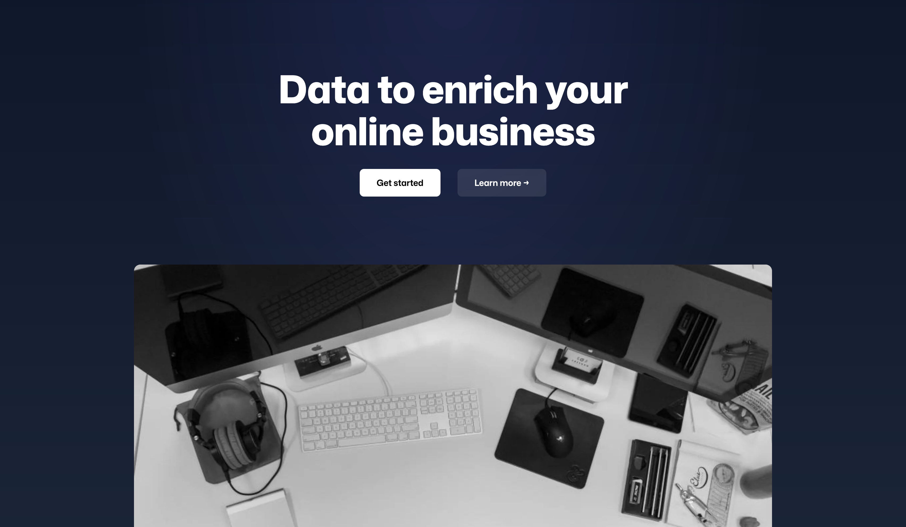

# Elayne — Premium Business Block Theme for WordPress



**Design better, build faster, publish sooner.** Elayne is a professional WordPress block theme designed for modern businesses, offering sophisticated patterns and conversion-optimized layouts — no coding or expensive page builders required.

## ✨ Why Choose Elayne?

- **🎯 Business-Focused**: Professional patterns specifically designed for corporate websites, service providers, and modern businesses
- **🚀 Industry-Specific Content**: Pattern sets optimized for spa, real estate, and professional services
- **💼 Conversion Optimized**: Built-in patterns designed to convert visitors into customers
- **📱 Mobile-First Design**: Every pattern is responsive and optimized for all devices
- **🎨 Clean, Modern Aesthetic**: Sophisticated design with professional color palettes and typography
- **🛠️ Full Site Editing**: Seamlessly integrated with WordPress's native site editor — drag, drop, and publish

Built by [Jasper Frumau](https://imagewize.com), Elayne empowers businesses to create stunning professional websites using the latest Full Site Editing features.

## 🚀 Quick Start

| Action | Link |
| --- | --- |
| **View Demo** | [demo.imagewize.com](https://demo.imagewize.com) |
| **Documentation** | [imagewize.com/themes/elayne](https://imagewize.com/themes/elayne) |
| **Support** | [imagewize.com/support](https://imagewize.com/support) |

### Requirements
- WordPress 6.6 or later
- PHP 8.0 or later

## 📦 Installation

1. Download the theme
2. Upload to `/wp-content/themes/elayne/`
3. Activate via **Appearance → Themes**
4. Start designing in **Appearance → Editor**

## 🎨 Features & Capabilities

### Pattern Library

Elayne includes **20+ professionally designed patterns** organized into categories:

**Hero Sections (3)**
- `hero-modern` - Contemporary hero with bold typography
- `hero-two-tone` - Split background hero with contrasting colors
- `hero-with-cta` - Hero section with prominent call-to-action

**Headers & Footers (4)**
- `header-light-with-standard-menu` - Classic navigation header
- `header-light-with-hamburger-menu` - Mobile-optimized hamburger menu
- `footer-light` - Professional light footer
- `footer-simple` - Minimal footer layout

**Call-to-Action & Contact (3)**
- `cta-newsletter` - Newsletter signup with email capture
- `contact-info` - Contact information display
- `contact-side-by-side` - Two-column contact layout

**Features & Services (2)**
- `three-column-feature-grid` - Grid layout for feature showcasing
- `services-feature-cards` - Service cards with icons and descriptions

**Team & Testimonials (3)**
- `team-grid` - Team member grid with photos and bios
- `testimonial-card` - Single testimonial card layout
- `client-reviews` - Client reviews with accent styling

**Statistics (2)**
- `stats-showcase` - Statistics display with visual emphasis
- `stats-list` - List-style statistics presentation

**Blog/Posts (4)**
- `blog-post-columns` - Classic blog grid layout
- `blog-post-columns-portrait` - Portrait-oriented blog grid
- `blog-post-list` - List-style blog layout
- `post-featured-two-column` - Featured post two-column layout

**Page Templates (11)**
- `template-page-full` - Full-width page template
- `template-page-wide` - Wide page template
- `template-page-wide-no-title` - Wide page without title
- `template-page-centered` - Centered content layout
- `template-page-left-sidebar` - Page with left sidebar
- `template-page-right-sidebar` - Page with right sidebar
- `template-page-404` - Custom 404 error page
- `template-page-archive` - Archive page template
- `template-page-search` - Search results template
- `template-index-grid` - Grid-style index template
- `template-index-list` - List-style index template

**Post Templates (4)**
- `template-post-centered` - Centered post layout
- `template-post-wide` - Wide post layout
- `template-post-left-sidebar` - Post with left sidebar
- `template-post-right-sidebar` - Post with right sidebar

### 🎯 Typography & Design

- **Primary Font**: Open Sans (variable weight, 300-800)
- **Fluid Typography**: Responsive font scaling with clamp()
- **Professional Color Palette**: Business-focused color scheme
- **Custom Shadows**: Multiple shadow presets for depth
- **Custom Image Sizes**: Optimized for portrait and landscape layouts

### 🚀 Technical Features

- **WordPress 6.6+** required
- **PHP 8.0+** required
- **Full Site Editing (FSE)** compatible
- **Block theme** architecture
- **Custom image sizes** for optimized layouts
- **Pattern categories** for easy organization

## 🛠️ For Developers

### Project Structure

```
elayne/
├── assets/
│   ├── fonts/          # Open Sans and other fonts
│   └── styles/         # Block-specific styles
├── languages/          # Translation files
├── parts/              # Template parts (header, footer)
├── patterns/           # Block patterns (36 patterns + templates)
├── templates/          # Page templates (index, single, page)
├── functions.php       # Theme setup and functionality
├── style.css           # Theme stylesheet and metadata
└── theme.json          # Global styles and settings
```

### Theme Features

- **Translation Ready**: Full internationalization support
- **Modern PHP 8.0+**: Clean, well-documented code
- **Child Theme Support**: Extend without modifying core
- **No Build Required**: Works out of the box
- **Custom Pattern Categories**: Organized pattern library

## 📚 Working with Full Site Editing

### Site Editor

Access the visual site builder at **Appearance → Editor** to:
- Edit headers, footers, and templates
- Customize global styles
- Create custom templates
- Build with patterns

### Creating Pages with Patterns

1. Create a new page
2. Insert a pattern from the Elayne collection
3. Choose appropriate page template (Full, Wide, Centered, etc.)
4. Customize content and publish

### Global Styles

Powered by `theme.json`, customize:
- Color palettes
- Typography scales
- Spacing and layout
- Block defaults

### Custom Image Sizes

- `elayne-portrait-small` (380×570) - 2:3 aspect ratio
- `elayne-portrait-medium` (380×507) - 3:4 aspect ratio
- `elayne-portrait-large` (380×475) - 4:5 aspect ratio
- `elayne-single-hero` (700×400) - 16:9-ish landscape

## Pattern Categories

Elayne registers custom pattern categories:
- Hero
- Features
- Call To Action
- Testimonials
- Team
- Statistics
- Contact
- Posts

## 📄 License

Elayne is licensed under the [GNU General Public License v2 or later](https://www.gnu.org/licenses/gpl-2.0.html).

## 🤝 Community & Support

- **Support**: [imagewize.com/support](https://imagewize.com/support)
- **Documentation**: [imagewize.com/themes/elayne](https://imagewize.com/themes/elayne)
- **Website**: [imagewize.com](https://imagewize.com)

## 👨‍💻 About

Elayne is created and maintained by [Jasper Frumau](https://imagewize.com).

### Credits

- **Theme Author**: Jasper Frumau
- **Open Sans Font**: Licensed under SIL Open Font License 1.1
- **Base Architecture**: Inspired by modern WordPress block theme standards

---

**Version**: 1.0.0-beta.5
**Last Updated**: December 2025

**[View Demo](https://demo.imagewize.com)** | **[Visit Imagewize](https://imagewize.com)**
