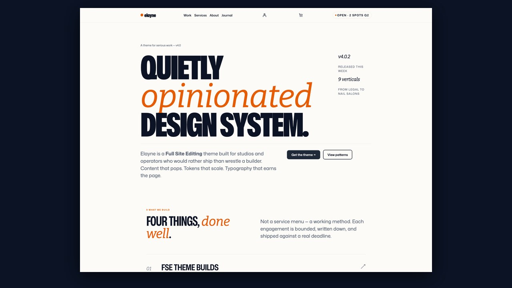

# Elayne — Professional WordPress Block Theme for Full Site Editing



Design better, build faster, publish sooner. Elayne is a professional WordPress block theme designed for modern businesses, offering sophisticated patterns and conversion-optimized layouts — no coding or expensive page builders required.

## Why Choose Elayne?

- **Business-Focused**: Professional patterns specifically designed for corporate websites, service providers, and modern businesses
- **Industry-Specific Content**: Pattern sets optimized for spa & wellness, legal services, food & beverage, and home improvement trades
- **Conversion Optimized**: Built-in patterns designed to convert visitors into customers
- **Mobile-First Design**: Every pattern is responsive and optimized for all devices
- **Clean, Modern Aesthetic**: Sophisticated design with professional color palettes and typography
- **True No-Code Solution**: Seamlessly integrated with WordPress's native site editor — drag, drop, and publish

Built by [Jasper Frumau](https://imagewize.com), Elayne empowers businesses to create stunning professional websites using the latest Full Site Editing features.

## Quick Start

| Action | Link |
| --- | --- |
| **View Demo** | [demo.imagewize.com](https://demo.imagewize.com) |
| **Documentation** | [imagewize.com/themes/elayne](https://imagewize.com/themes/elayne) |
| **Support** | [imagewize.com/support](https://imagewize.com/support) |

### Requirements
- WordPress 6.6 or later
- PHP 8.0 or later

## Installation

1. Download the theme from [GitHub releases](https://github.com/imagewize/elayne/releases) or WordPress.org
2. Upload via **Appearance → Themes → Add New** or manually to `/wp-content/themes/elayne/`
3. Activate via **Appearance → Themes**
4. Start designing in **Appearance → Editor**

For developer installation and setup, see [CONTRIBUTING.md](CONTRIBUTING.md)

## What's Included

**125+ patterns** across hero sections, features, CTAs, testimonials, cards, blog, portfolio, and more — plus 24 WooCommerce patterns covering the full shopping journey. Includes 19 page, post, and WooCommerce templates.

**Industry verticals** with complete, ready-to-use pattern sets: Food & Beverage • Legal Services • Home Improvement • Spa & Wellness • Nail Salon • WooCommerce Store

**8 style variations** — switch your entire site's look with one click in **Appearance → Editor → Styles**

**32+ CSS block styles** — interactive animations and effects with zero JavaScript, applied via the Styles panel in the block editor

Browse the complete pattern library in **Appearance → Editor → Patterns**. See [CONTRIBUTING.md](CONTRIBUTING.md) for the full pattern inventory and developer documentation.

## Getting Started

Access the WordPress Site Editor at **Appearance → Editor** to customize your site. Insert patterns, edit templates, and adjust global styles — all with drag-and-drop simplicity. Visit the [documentation](https://imagewize.com/themes/elayne) for detailed tutorials.

## Companion Plugins

### Elayne Blocks

Elayne works seamlessly with the **[Elayne Blocks](https://github.com/imagewize/elayne-blocks)** plugin, which adds 5 custom blocks: Mega Menu, Carousel, Slide, FAQ Tabs, and Search Overlay Trigger. These blocks are theme-agnostic and work with any WordPress theme.

Download from the [Elayne Blocks repository](https://github.com/imagewize/elayne-blocks) and install via **Plugins → Add New → Upload Plugin**.

### Waygate AI Builder (Beta)

[Waygate](https://github.com/imagewize/waygate) is an AI-powered pattern page builder for Elayne. Describe a page or section in plain language and Waygate assembles it from Elayne's pattern library.

> **Beta notice:** Waygate is under active development. Expect breaking changes between releases.

**Install from GitHub:** Download from [github.com/imagewize/waygate/releases](https://github.com/imagewize/waygate/releases) and upload via **Plugins → Add New → Upload Plugin**.

**Install via Composer** (Bedrock / developer setup):

```bash
composer require imagewize/waygate
```

## Community & Support

- **Support**: [imagewize.com/support](https://imagewize.com/support)
- **Documentation**: [imagewize.com/themes/elayne](https://imagewize.com/themes/elayne)
- **Website**: [imagewize.com](https://imagewize.com)
- **Contributing**: See [CONTRIBUTING.md](CONTRIBUTING.md) for developer documentation

## About

Elayne is created and maintained by [Jasper Frumau](https://imagewize.com).

### Credits

- **Theme Author**: Jasper Frumau
- **Fonts & Images**: All fonts and images are GPL-compatible. See [readme.txt](readme.txt) for complete license details and attribution.
- **Base Architecture**: Inspired by modern WordPress block theme standards

**[View Demo](https://demo.imagewize.com)** | **[Visit Imagewize](https://imagewize.com)**
